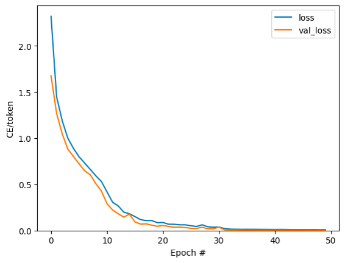
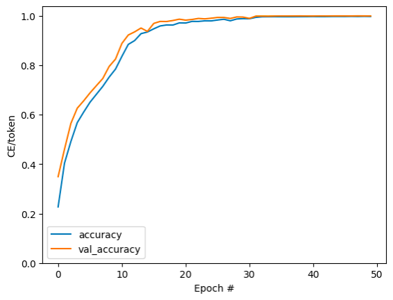

# machine-translation-artificial-language
This study focuses on machine translation for two synthetic languages: an "Input Language" and an "Output Language." The aim is to construct a model that can effectively translate texts from the "Input Language" to the "Output Language." As an illustration, a sample text in the "Input Language" might appear as 
  
    "a g b f a f a e a k a j c f b f c d a k a k c e b g a h a k b d b f b f b d c d," 

while its corresponding translation in the "Output Language" would be 
  
    "b f c f b f c d a j e f g c e b g a k i j b d b f a k l m b f b d a h ed ee ef a k k eg a k h eh a e ei c d a f ej ek a g d el."

The challenge is that model's performance will be assessed using a testing set similar to the aforementioned training set. The evaluation metric, "test accuracy," measures the fidelity of the model's translations. A translation in the Output Language generated by the model will be deemed "correct" only if it precisely matches the ground-truth text. Thus, the "test accuracy" of your model is determined by the ratio of "correctly translated texts" to "the total number of samples in the test set."

## Dataset
This study uses a dataset for CSCE 636 Deep Learning class, which cannot be publicly shared. A portion (20%) of the train dataset was randomly reserved for testing experiments.
1. Add a *start* and *end* token to each sentence.
3. Create a word index and reverse word index (dictionaries mapping from word → id and id → word).
4. Pad each sentence to a maximum length.
5. Create a `tf.data.Dataset` of strings that shuffles and batches them efficiently:

## Text preprocessing
All the text processing happens inside the model using a `layers.TextVectorization` layer.
## Source Text Vectorization and Target Text Vectorization
* Using a `tf.keras.layers.TextVectorization` layer which will handle the vocabulary extraction and conversion of input text to sequences of tokens.
* The `TextVectorization` layer has an `adapt` method. This method reads one epoch of the training data, and works a lot like `Model.fit`. This `adapt` method initializes the layer based on the data. Here it determines the vocabulary.

### Process the dataset
* The `process_text` function converts the `Datasets` of strings, into  0-padded tensors of token IDs. It also converts from a `(context, target)` pair to an `((context, target_in), target_out)` pair for training with `keras.Model.fit`. Keras expects `(inputs, labels)` pairs, the inputs are the `(context, target_in)` and the labels are `target_out`. The difference between `target_in` and `target_out` is that they are shifted by one step relative to eachother, so that at each location the label is the next token.

## The encoder/decoder

The following diagram shows an overview of the model. The encoder is on the left, the decoder is on the right. At each time-step the decoder's output is combined with the encoder's output, to predict the next word.

<table>
<tr>
  <td>
   
  </td>
</tr>
<tr>
  <th colspan=1>Model</th>
<tr>
</table>

### The encoder

The goal of the encoder is to process the context sequence into a sequence of vectors that are useful for the decoder as it attempts to predict the next output for each timestep. Since the context sequence is constant, there is no restriction on how information can flow in the encoder, so use a bidirectional-RNN to do the processing:

 <table>
<tr>
  <td>
   
  </td>
</tr>
<tr>
  <th>A bidirectional RNN</th>
<tr>
</table> 

1. Takes a list of token IDs (from `context_text_processor`).
3. Looks up an embedding vector for each token (Using a `layers.Embedding`).
4. Processes the embeddings into a new sequence (Using a bidirectional `layers.GRU`).
5. Returns the processed sequence. This will be passed to the attention head.

### The attention layer

The attention layer lets the decoder access the information extracted by the encoder. It computes a vector from the entire context sequence, and adds that to the decoder's output.

The simplest way to calculate a single vector from the entire sequence would be to take the average across the sequence (`layers.GlobalAveragePooling1D`). An attention layer is similar, but calculates a **weighted** average across the context sequence. W the weights are calculated from the combination of context and "query" vectors.
 
<table>
<tr>
  <td>
   
  </td>
</tr>
<tr>
  <th colspan=1>The attention layer</th>
<tr>
</table> 

### The decoder

The decoder's job is to generate predictions for the next token at each location in the target sequence.

1. It looks up embeddings for each token in the target sequence.
2. It uses an RNN to process the target sequence, and keep track of what it has generated so far.
3. It uses RNN output as the "query" to the attention layer, when attending to the encoder's output.
4. At each location in the output it predicts the next token.

When training, the model predicts the next word at each location. The decoder uses a unidirectional RNN to process the target sequence.

When running inference with this model it produces one word at a time, and those are fed back into the model.

<table>
<tr>
  <td>
   
  </td>
</tr>
<tr>
  <th>A unidirectional RNN</th>
<tr>
</table>

## Training
Decoder's `call` method, takes 3 arguments:

* `inputs` -  a `context, x` pair where:
  * `context` - is the context from the encoder's output.
  * `x` - is the target sequence input.
* `state` - Optional, the previous `state` output from the decoder (the internal state of the decoder's RNN). Pass the state from a previous run to continue generating text where left off.
* `return_state` - [Default: False] - Set this to `True` to return the RNN state.

## Translate

A function to execute the full `text => text` translation. This code is identical to code used in encoder and decoder and also captures the attention weights. The `translate` function works on batches, so multiple texts can be passed all at once, which is much more efficient than translating them one at a time.
To export this model, wrap `translate` method in a `tf.function`.

## Testing
- Final testing was conducted by course officials on an unseen dataset.
- **Accuracy on actual train dataset:** 98.0%
- **Accuracy on actual test dataset:** 97.9%
- The trained model will be made available upon request.

## Lessons Learned
- Sometimes it is better to use simple RNN than complex transformers.
- Creating customized metrics from scratch is difficult, no wonder there are quite less metrics available and a major portion of them focuses only on accuracy.

## Acknowledgements
- [Deep Learning with Python Notebooks by fchollet](https://github.com/fchollet/deep-learning-with-python-notebooks/blob/master/chapter11_part04_sequence-to-sequence-learning.ipynb)
- [Effective Approaches to Attention-based Neural Machine Translation, Minh-Thang Luong, Hieu Pham, Christopher D. Manning](https://arxiv.org/abs/1508.04025v5)
- [Neural machine translation with attention](https://www.tensorflow.org/text/tutorials/nmt_with_attention)
- Some figures are taken from [Tensorflow website](https://www.tensorflow.org/text/tutorials/nmt_with_attention).
- **Professor Anxiao (Andrew) Jiang and Teaching Assistant Xiaotian Han:** For guidance, support, and valuable insights throughout this project.

